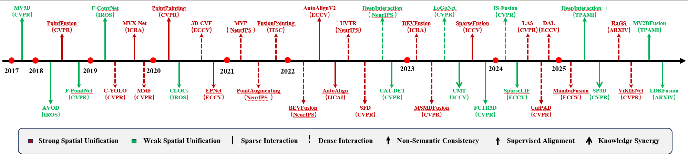
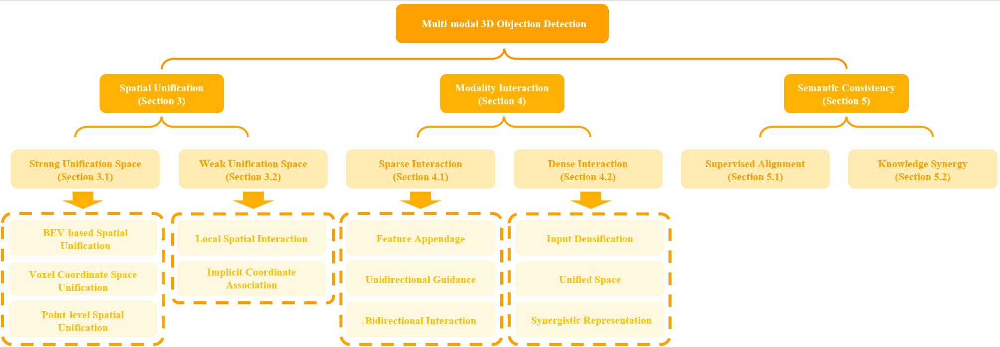

# Multi-modal-3D-Object-Detection

Our paper “_**[Multimodal 3D Object Detection: A Review and Outlook]**_”

     
    

     
    

## Papers

### 2025

#### CVPR 2025 (Accepted Papers)

* [Submitted on 4 Apr, 2025] ZFusion: An Effective Fuser of Camera and 4D Radar for 3D Object Perception in Autonomous Driving [[paper](https://arxiv.org/pdf/2504.03438)]
* [Submitted on 4 Apr, 2025] PF3Det: A Prompted Foundation Feature Assisted Visual LiDAR 3D Detector [[paper](https://arxiv.org/pdf/2504.03563)]
* [Submitted on 9 Mar, 2025] SP3D: Boosting Sparsely-Supervised 3D Object Detection via Accurate Cross-Modal Semantic Prompts [[paper](https://arxiv.org/pdf/2503.06467)] [[code](https://github.com/xmuqimingxia/SP3D)]
* ViKIENet: Towards Efficient 3D Object Detection with Virtual Key Instance Enhanced Network

#### ICCV 2025 (Accepted Papers)

* [Submitted on 19 Aug, 2025] Self-Supervised Sparse Sensor Fusion for Long Range Perception [[paper](https://arxiv.org/pdf/2508.13995)] [[code](https://github.com/princeton-computational-imaging/LRS4Fusion)]
* [Submitted on 6 Jul, 2025] MambaFusion: Height-Fidelity Dense Global Fusion for Multi-modal 3D Object Detection [[paper](https://arxiv.org/pdf/2507.04369)] [[code](https://github.com/AutoLab-SAI-SJTU/MambaFusion)]
* [Submitted on 16 Nov, 2024] MambaFusion: Height-Fidelity Dense Global Fusion for Multi-modal 3D Object Detection [[paper](https://arxiv.org/pdf/2411.10715)]

#### AAAI 2025 (Accepted Papers)

* [Submitted on 7 Apr, 2025] SSLFusion: Scale & Space Aligned Latent Fusion Model for Multimodal 3D Object Detection [[paper](https://arxiv.org/pdf/2504.05170)] [[code](https://github.com/TLDBN/SSLFusion)]
* [Submitted on 16 Dec, 2024] HGSFusion: Radar-Camera Fusion with Hybrid Generation and Synchronization for 3D Object Detection [[paper](https://arxiv.org/pdf/2412.11489)] [[code](https://github.com/garfield-cpp/HGSFusion)]

#### TPAMI 2025 (Accepted Papers)

* [Submitted on 12 Aug, 2024] MV2DFusion: Leveraging Modality-Specific Object Semantics for Multi-Modal 3D Detection [[paper](https://arxiv.org/pdf/2408.05945)]
* [Submitted on 9 Aug, 2024] DeepInteraction++: Multi-Modality Interaction for Autonomous Driving [[paper](https://arxiv.org/pdf/2408.05075)] [[code](https://github.com/fudan-zvg/DeepInteraction)]

#### Arxiv

* [Submitted on 3 Aug, 2025] Adaptive LiDAR Scanning: Harnessing Temporal Cues for Efficient 3D Object Detection via Multi-Modal Fusion [[paper](https://arxiv.org/pdf/2508.01562)]
* [Submitted on 26 Jul, 2025] RaGS: Unleashing 3D Gaussian Splatting from 4D Radar and Monocular Cues for 3D Object Detection [[paper](https://arxiv.org/pdf/2507.19856)]
* [Submitted on 22 Jul, 2025] LDRFusion: A LiDAR-Dominant multimodal refinement framework for 3D object detection [[paper](https://arxiv.org/pdf/2507.16224)]
* [Submitted on 17 Mar, 2025] Efficient Multimodal 3D Object Detector via Instance-Level Contrastive Distillation [[paper](https://arxiv.org/pdf/2503.12914)] [[code](https://github.com/nubot-nudt/ICD-Fusion)]
* [Submitted on 12 Mar, 2025] Dual-Domain Homogeneous Fusion with Cross-Modal Mamba and Progressive Decoder for 3D Object Detection [[paper](https://arxiv.org/pdf/2503.08992)]
* [Submitted on 12 May, 2025] DepthFusion: Depth-Aware Hybrid Feature Fusion for LiDAR-Camera 3D Object Detection [[paper](https://arxiv.org/pdf/2505.07398)]
* [Submitted on 11 May, 2025] SparseVoxFormer: Sparse Voxel-based Transformer for Multi-modal 3D Object Detection [[paper](https://arxiv.org/pdf/2503.08092)]

### 2024

#### CVPR 2024 (Accepted Papers)

* [Submitted on 1 Nov, 2024 ] GAFusion: Adaptive Fusing LiDAR and Camera with Multiple Guidance for 3D Object Detection [[paper](https://arxiv.org/pdf/2411.00340)]
* [Submitted on 25 Mar, 2024] RCBEVDet: Radar-camera Fusion in Bird's Eye View for 3D Object Detection [[paper](https://arxiv.org/pdf/2403.16440)] [[code](https://github.com/VDIGPKU/RCBEVDet)]
* [Submitted on 22 Mar, 2024] IS-Fusion: Instance-Scene Collaborative Fusion for Multimodal 3D Object Detection [[paper](https://arxiv.org/pdf/2403.15241)] [[code](https://github.com/yinjunbo/IS-Fusion)]
* [Submitted on 22 Dec, 2023] Lift-Attend-Splat: Bird's-eye-view camera-lidar fusion using transformers [[paper](https://arxiv.org/pdf/2312.14919)]
* [Submitted on 12 Oct, 2023 ] UniPAD: A Universal Pre-training Paradigm for Autonomous Driving [[paper](https://arxiv.org/abs/2310.08370)] [[code](https://github.com/Nightmare-n/UniPAD)]

#### ECCV 2024 (Accepted Papers)

* [Submitted on 18 Mar, 2024] GraphBEV: Towards Robust BEV Feature Alignment for Multi-Modal 3D Object Detection [[paper](https://arxiv.org/pdf/2403.11848)]
* [Submitted on 12 Mar, 2024] SparseLIF: High-Performance Sparse LiDAR-Camera Fusion for 3D Object Detection [[paper](https://arxiv.org/pdf/2403.07284)]
* [Submitted on 13 Nov, 2023] Detecting As Labeling: Rethinking LiDAR-camera Fusion in 3D Object Detection [[paper](https://arxiv.org/pdf/2311.07152)]  [[code](https://github.com/HuangJunJie2017/BEVDet)]
* [Submitted on 6 Apr, 2023] DifFUSER: Diffusion Model for Robust Multi-Sensor Fusion in 3D Object Detection and BEV Segmentation [[paper](https://arxiv.org/pdf/2404.04629)]

#### ICRA 2024 (Accepted Papers)

* [Submitted on 12 Mar, 2024] Eliminating Cross-modal Conflicts in BEV Space for LiDAR-Camera 3D Object Detection [[paper](https://arxiv.org/pdf/2403.07372)] [[code](https://github.com/fjhzhixi/ECFusion)]
* [Submitted on 12 Feb, 2024] AYDIV: Adaptable Yielding 3D Object Detection via Integrated Contextual Vision Transformer [[paper](https://arxiv.org/pdf/2402.07680)] [[code](https://github.com/sanjay-810/AYDIV2)]
* [Submitted on 16 Oct, 2023] Multimodal Object Query Initialization for 3D Object Detection [[paper](https://arxiv.org/pdf/2310.10353)]

#### TPAMI 2024 (Accepted Papers)

* [Submitted on 24 Apr, 2023] Fully Sparse Fusion for 3D Object Detection [[paper]([https://arxiv.org/pdf/2403.07372](https://arxiv.org/pdf/2304.12310))] [[code](https://github.com/BraveGroup/FullySparseFusion)]

#### Arxiv

* [Submitted on 14 Mar, 2024] PoIFusion: Multi-Modal 3D Object Detection via Fusion at Points of Interest [[paper](https://arxiv.org/pdf/2403.09212)] [[code](https://djiajunustc.github.io/projects/poifusion/)]

### 2023

#### CVPR 2023 (Accepted Papers)

* [Submitted on 7 Sep, 2022] MSMDFusion: Fusing LiDAR and Camera at Multiple Scales with Multi-Depth Seeds for 3D Object Detection [[paper](https://arxiv.org/pdf/2209.03102)] [[code](https://github.com/SxJyJay/MSMDFusion)]
* [Submitted on 20 Mar, 2022] FUTR3D: A Unified Sensor Fusion Framework for 3D Detection [[paper](https://arxiv.org/pdf/2203.10642)]
* [Submitted on 7 Mar, 2023] LoGoNet: Towards Accurate 3D Object Detection with Local-to-Global Cross-Modal Fusion [[paper](https://arxiv.org/pdf/2303.03595)] [[code](https://github.com/sankin97/LoGoNet)]
* [Submitted on 4 Mar, 2023] Virtual Sparse Convolution for Multimodal 3D Object Detection [[paper](https://arxiv.org/pdf/2303.02314)] [[code](https://github.com/hailanyi/VirConv)]

#### ICCV 2023 (Accepted Papers)

* [Submitted on 15 Aug, 2023 ] UniTR: A Unified and Efficient Multi-Modal Transformer for Bird's-Eye-View Representation [[paper](https://arxiv.org/pdf/2308.07732)] [[code](https://github.com/Haiyang-W/UniTR)]
* [Submitted on 8 Aug, 2023 ] FocalFormer3D : Focusing on Hard Instance for 3D Object Detection [[paper](https://arxiv.org/pdf/2308.04556)] [[code](https://github.com/NVlabs/FocalFormer3D)]
* [Submitted on 27 Apr, 2023 ] SparseFusion: Fusing Multi-Modal Sparse Representations for Multi-Sensor 3D Object Detection [[paper](https://arxiv.org/pdf/2304.14340)] [[code](https://github.com/yichen928/SparseFusion)]
* [Submitted on 3 Jan, 2023 ] Cross Modal Transformer: Towards Fast and Robust 3D Object Detection [[paper](https://arxiv.org/pdf/2301.01283)] [[code](https://github.com/junjie18/CMT)]
* [Submitted on 24 Nov, 2022] 3D Dual-Fusion: Dual-Domain Dual-Query Camera-LiDAR Fusion for 3D Object Detection [[paper](https://arxiv.org/pdf/2211.13529)]
* ObjectFusion: Multi-modal 3D Object Detection with Object-Centric Fusion

#### ICRA 2023 (Accepted Papers)

* [Submitted on 26 Sep, 2022] Center Feature Fusion: Selective Multi-Sensor Fusion of Center-based Objects [[paper](https://arxiv.org/pdf/2209.12880)]
* [Submitted on 26 May, 2022] BEVFusion: Multi-Task Multi-Sensor Fusion with Unified Bird's-Eye View Representation [[paper](https://arxiv.org/pdf/2205.13542)] [[code](https://github.com/mit-han-lab/bevfusion)]

#### Arxiv

* [Submitted on 11 Sep, 2023] FusionFormer: A Multi-sensory Fusion in Bird's-Eye-View and Temporal Consistent Transformer for 3D Object Detection [[paper]([https://arxiv.org/pdf/2303.17099](https://arxiv.org/pdf/2309.05257))]
* [Submitted on 30 Mar, 2023] BEVFusion4D: Learning LiDAR-Camera Fusion Under Bird's-Eye-View via Cross-Modality Guidance and Temporal Aggregation [[paper](https://arxiv.org/pdf/2303.17099)]

### 2022

#### CVPR 2022 (Accepted Papers)

* [Submitted on 31 May, 2022] Voxel Field Fusion for 3D Object Detection [[paper](https://arxiv.org/pdf/2205.15938)] [[code](https://github.com/dvlab-research/VFF)]
* [Submitted on 26 Apr, 2022] Focal Sparse Convolutional Networks for 3D Object Detection [[paper](https://arxiv.org/pdf/2204.12463)] [[code](https://github.com/dvlab-research/FocalsConv)]
* [Submitted on 1 Apr, 2022] CAT-Det: Contrastively Augmented Transformer for Multi-modal 3D Object Detection [[paper](https://arxiv.org/pdf/2204.00325)]
* [Submitted on 22 Mar, 2022] TransFusion: Robust LiDAR-Camera Fusion for 3D Object Detection with Transformers [[paper](https://arxiv.org/pdf/2203.11496)] [[code](https://github.com/XuyangBai/TransFusion/)]
* [Submitted on 18 Mar, 2022] Sparse Fuse Dense: Towards High Quality 3D Detection with Depth Completion [[paper](https://arxiv.org/pdf/2203.09780)] [[code](https://github.com/LittlePey/SFD)]
* [Submitted on 15 Mar, 2022] DeepFusion: Lidar-Camera Deep Fusion for Multi-Modal 3D Object Detection [[paper](https://arxiv.org/pdf/2203.08195)] [[code](https://github.com/tensorflow/lingvo/tree/master/lingvo)]

#### NeurIPS 2022 (Accepted Papers)

* [Submitted on 23 Aug, 2022] DeepInteraction: 3D Object Detection via Modality Interaction [[paper](https://arxiv.org/pdf/2208.11112)] [[code](https://github.com/fudan-zvg/DeepInteraction)]
* [Submitted on 27 May, 2022] BEVFusion: A Simple and Robust LiDAR-Camera Fusion Framework [[paper](https://arxiv.org/pdf/2205.13790)] [[code](https://github.com/ADLab-AutoDrive/BEVFusion)]
* [Submitted on 1 Jun, 2022] Unifying Voxel-based Representation with Transformer for 3D Object Detection [[paper](https://arxiv.org/pdf/2206.00630)] [[code](https://github.com/dvlab-research/UVTR)]

#### ECCV 2022 (Accepted Papers)

* [Submitted on 21 Jul, 2022] AutoAlignV2: Deformable Feature Aggregation for Dynamic Multi-Modal 3D Object Detection [[paper](https://arxiv.org/pdf/2207.10316)] [[code](https://github.com/zehuichen123/AutoAlignV2)]
* [Submitted on 7 Aug, 2022] Graph R-CNN: Towards Accurate 3D Object Detection with Semantic-Decorated Local Graph [[paper](https://arxiv.org/pdf/2208.03624)] [[code](https://github.com/Nightmare-n/GraphRCNN)]
* [Submitted on 18 Oct, 2022] Homogeneous Multi-modal Feature Fusion and Interaction for 3D Object Detection [[paper](https://arxiv.org/pdf/2210.09615)]

#### Arxiv

* [Submitted on 24 Nov, 2022] 3D Dual-Fusion: Dual-Domain Dual-Query Camera-LiDAR Fusion for 3D Object Detection [[paper](https://arxiv.org/pdf/2211.13529)]

## Survey

* Multi-modal 3d object detection in autonomous driving: A survey and taxonomy
* Multi-modal 3d object detection in autonomous driving: a survey
* Multi-modal Sensor Fusion for Auto Driving Perception: A Survey
* Multi-modality 3D object detection in autonomous driving: A review

## Dataset

* [Submitted on 14 Dec, 2024] OmniHD-Scenes: A Next-Generation Multimodal Dataset for Autonomous Driving [[paper](https://arxiv.org/pdf/2412.10734)]
* [Submitted on 10 Jul, 2024] MAN TruckScenes: A multimodal dataset for autonomous trucking in diverse conditions [[paper](https://arxiv.org/pdf/2407.07462)]
* [Submitted on 2 Jan, 2023] Argoverse 2: Next Generation Datasets for Self-Driving Perception and Forecasting [[paper](https://arxiv.org/pdf/2301.00493)]
* [Submitted on 28 Apr, 2022] TJ4DRadSet: A 4D Radar Dataset for Autonomous Driving [[paper](https://arxiv.org/pdf/2204.13483)]
* [Submitted on 18 Mar, 2022] Boreas: A Multi-Season Autonomous Driving Dataset [[paper](https://arxiv.org/pdf/2203.10168)]
* [Submitted on 23 Dec, 2021] PandaSet: Advanced Sensor Suite Dataset for Autonomous Driving [[paper](https://arxiv.org/pdf/2112.12610)]
* [Submitted on 21 Jun, 2021] One Million Scenes for Autonomous Driving: ONCE Dataset [[paper](https://arxiv.org/pdf/2106.11037)]
* [Submitted on 5 Dec, 2021] Cirrus: A Long-range Bi-pattern LiDAR Dataset [[paper](https://arxiv.org/pdf/2012.02938)]
* [Submitted on 14 Apr, 2020] A2D2: Audi Autonomous Driving Dataset [[paper](https://arxiv.org/pdf/2004.06320)]
* [Submitted on 10 Dec, 2019] Scalability in Perception for Autonomous Driving: Waymo Open Dataset [[paper](https://arxiv.org/pdf/1912.04838)]
* [Submitted on 6 Nov, 2019] Argoverse: 3D Tracking and Forecasting with Rich Maps [[paper](https://arxiv.org/pdf/1911.02620)]
* [Submitted on 17 Sep, 2019] A*3D Dataset: Towards Autonomous Driving in Challenging Environments [[paper](https://arxiv.org/pdf/1909.07541)]
* [Submitted on 26 Mar, 2019] nuScenes: A multimodal dataset for autonomous driving [[paper](https://arxiv.org/pdf/1903.11027)]
* Multi-class road user detection with 3+ 1d radar in the view-of-delft dataset
* Automotive radar dataset for deep learning based 3d object detection
* The apolloscape dataset for autonomous driving
* KAIST multi-spectral day/night data set for autonomous and assisted driving
* Are we ready for autonomous driving? The KITTI vision benchmark suite

